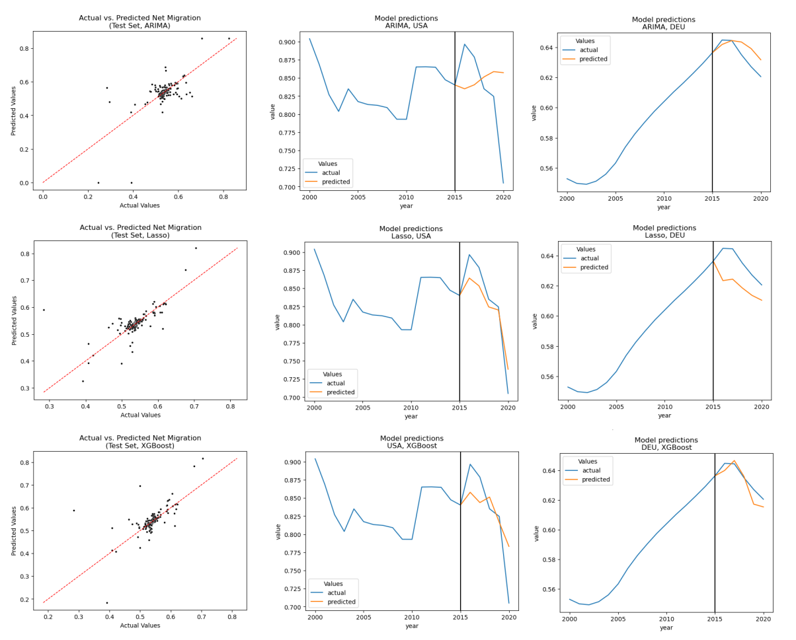

# migration-flow-prediction

Predicting net migration using ARIMA, Lasso-Regression, XGBoost & LSTM-RNNs.

## Reproduce

The preprocessing is applied in [`src/preprocessing.ipynb`](https://github.com/kssrr/migration-flow-prediction/blob/main/src/preprocessing.ipynb). The benchmark-models (ARIMA, Lasso-Regression & XGBoost) are fit in [`benchmarks.ipynb`](https://github.com/kssrr/migration-flow-prediction/blob/main/src/benchmarks.ipynb). 

## Sneak Peek

Here is some eyecandy:

## Credit

Collaborators:

* [Robin Aytac](https://github.com/AytacRB)

* [Lea Froitzheim](https://github.com/LeaKata)

* [Lennart Kasserra](https://github.com/kssrr)

* [Theresa Wagner](https://github.com/tetesoph)
